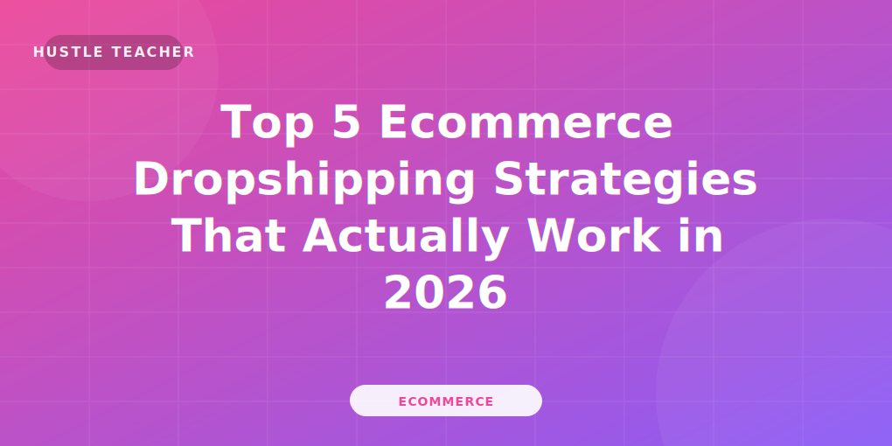

---
# 1. Title and Keywords Structure
# SEO Title Formula: [Number] + [Primary Keyword] + [Benefit/Result] + [Year]
title: "[Insert Catchy SEO Title Here]"

# 2. Featured Image
# Requirements: < 200kb, WebP format preferred, Alt text must contain Primary Keyword
heroImage: "../../assets/blog/ecommerce-dropshipping.svg"

# 3. Meta Description (SEO Only - Not visible on page)
# Requirements: 150-160 characters. Must include Primary Keyword.
metaDescription: "Looking to master [Primary Keyword]? This 2026 guide reveals the exact strategies to [Benefit] and grow your business today. Click to read more!"

description: "A placeholder description for the blog template."

# 4. Category, Title Image (Hero) + Published date
category: "category-slug" 
pubDate: "Month Day, 2026"

# SEO Keywords Strategy (Internal Tracking)
primaryKeyword: "[Main Keyword]"
secondaryKeywords: ["[Keyword 2]", "[Keyword 3]", "[Keyword 4]"]
longTailKeywords: ["[Long Tail 1]", "[Long Tail 2]"]

# 11. FAQs (Schema-ready)
faqs:
  - question: "Is [Primary Keyword] still profitable in 2026?"
    answer: "Absolutely! With the rise of [Trend], [Primary Keyword] remains one of the most effective ways to [Benefit]."
  - question: "How long does it take to see results?"
    answer: "Most beginners see initial results within [Timeframe], provided they follow the [Step] consistently."
---

import BlogQuickSummary from '../../components/BlogQuickSummary.astro';
import BlogToolRecommendation from '../../components/BlogToolRecommendation.astro';
import BlogComparisonTable from '../../components/BlogComparisonTable.astro';
import BlogFAQ from '../../components/BlogFAQ.astro';
import BlogMonetization from '../../components/BlogMonetization.astro';
import BlogCTA from '../../components/BlogCTA.astro';
import BlogTableOfContents from '../../components/BlogTableOfContents.astro';

{/* 3. Hook Introduction (Content Only - Visible to reader) */}
{/* Pattern: Problem -> Empathy -> Promise (The "The Big Secret" Hook) */}

## ❓ Why Most People Fail at [Primary Keyword] (And How You Won't)

Are you tired of [Common Pain Point]? Many people dive into **[Primary Keyword]** expecting overnight success, only to be met with [Common Roadblock]. 

But here is the truth: [Primary Keyword] is actually simpler than it looks if you have the right roadmap. In this guide, we are going to break down the exact strategy to help you [Benefit] by the end of this month.

{/* 4. Category and Date are automatically displayed by the Layout */}

{/* 6. Table of Contents (SEO + UX) */}
{/* 
This helps:
Google understand structure
Users scan fast
Boost featured snippets
*/}
<BlogTableOfContents 
  items={[
    { label: "The Fundamentals of [Primary Keyword]", targetId: "fundamentals" },
    { label: "Step-by-Step Implementation Guide", targetId: "guide" },
    { label: "Top Tools for Automation", targetId: "tools" },
    { label: "Comparison Table", targetId: "comparison" },
    { label: "Expert Tips for 2026", targetId: "tips" },
    { label: "Frequently Asked Questions", targetId: "faq" }
  ]}
/>

{/* 7. Main Content Sections (H2) */}

## 🚀 1. The Fundamentals of [Primary Keyword]
{/* HINT: Explain 'What' and 'Why' here. Aim for 300-400 words. */}
Explain the core concept here. Why is this relevant in 2026? Use bold text for key takeaways.

{/* 6. Images/Screenshots */}
{/* HINT: Place an image every 300-400 words to break up text. */}

*Caption: How [Primary Keyword] integrates into your workflow.*

## 📖 2. Step-by-Step Implementation Guide
{/* HINT: This is your meat. Use H3s for each step. Aim for 800+ words here. */}

### 🪜 Step 1: Market Research
How to find your niche...

### 🪜 Step 2: Setting Up Your Infrastructure
Tools you need to get started...

{/* 7. Tools/Resources */}
## 🧰 3. Essential Tools & Resources
<BlogToolRecommendation 
  name="Recommended Tool A" 
  description="This tool is essential for [Task] because it automates [Process]."
  url="https://example.com/tool"
  icon="🚀"
/>

{/* 8. Comparison Table */}
## ✨ 4. Comparison Table: Choosing Your Path
<BlogComparisonTable 
  title="Strategy Comparison"
  headers={["Strategy", "Cost", "Time to Result", "Ease of Use"]}
  rows={[
    ["Method Alpha", "Low", "2 Weeks", "Easy"],
    ["Method Beta", "Medium", "1 Month", "Moderate"]
  ]}
/>

{/* 11. FAQs */}
## 🤔 Frequently Asked Questions
<BlogFAQ faqs={frontmatter.faqs} />

{/* 12. Conclusion */}
## 🏁 Conclusion: Start Your [Primary Keyword] Journey Today
Recap the main points. Remind them that the best time to start was yesterday; the second best time is now.

{/* 13. CTA (Call to Action) */}
<BlogCTA 
  title="Ready to Master [Primary Keyword]?"
  description="Join our newsletter and get the exclusive 2026 Roadmap delivered to your inbox."
  buttonText="Download Now"
  buttonUrl="/#newsletter"
  type="download"
/>

{/* 14. Related Posts & 15. Author Box */}
{/* HINT: These sections are automatically handled by the Layout. You don't need to add them here. */}
