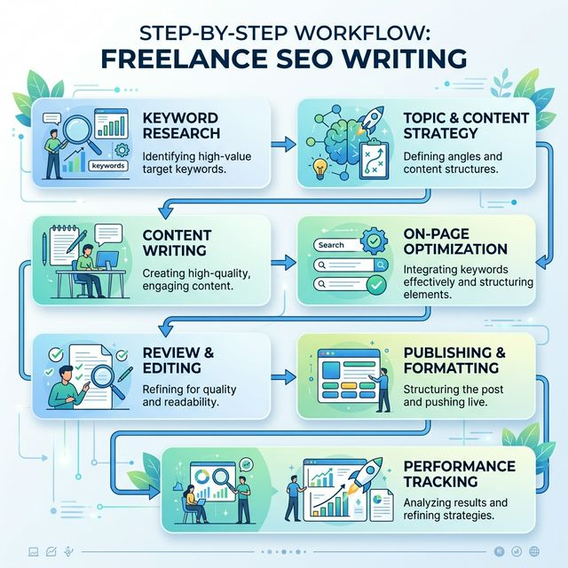

import BlogQuickSummary from '../../components/BlogQuickSummary.astro';
import BlogToolRecommendation from '../../components/BlogToolRecommendation.astro';
import BlogComparisonTable from '../../components/BlogComparisonTable.astro';
import BlogFAQ from '../../components/BlogFAQ.astro';
import BlogCTA from '../../components/BlogCTA.astro';
import BlogTableOfContents from '../../components/BlogTableOfContents.astro';
import BlogAuthor from '../../components/BlogAuthor.astro';
import SEOSchema from '../../components/SEOSchema.astro';

<SEOSchema 
  type="BlogPosting"
  title={frontmatter.title}
  description={frontmatter.description}
  image={frontmatter.heroImage}
  publishedDate={new Date(frontmatter.pubDate)}
  author="Hustle Teacher"
/>

## Everyone is a "writer" today.
But very few are professional **Content Writers.**

In 2026, the internet is flooded with generic AI-generated text.
It's boring. It's repetitive. And readers are sick of it.

That is why businesses are desperately looking for **Human Writers.**
Writers who can tell a story, share a deep insight, and build a real connection.

If you can write words that people actually *want* to read, you possess a superpower.

But how do you move from "writing for fun" to "writing for high-paying clients?"

This masterclass will show you the exact path.
No fluff. Just the strategy to build a sustainable writing career.

Let’s turn your thoughts into an income stream.

<BlogQuickSummary 
  title="📌 What You'll Learn"
  items={[
    "The 2026 'Human-First' Content Writing model",
    "Why storytelling is the most valuable skill you can own",
    "The 5 writing formats that pay the most in 2026",
    "A 10-step roadmap to your first $200 article",
    "How to build a portfolio that closes high-ticket deals",
    "Tools to write 2x faster without losing your soul"
  ]} 
/>

<BlogTableOfContents 
  items={[
    { label: "What is Content Writing in 2026?", targetId: "what-is" },
    { label: "The Shift to Storytelling", targetId: "storytelling" },
    { label: "High-Value Writing Formats", targetId: "formats" },
    { label: "The 10-Step Beginner Roadmap", targetId: "roadmap" },
    { label: "How to Build a Portfolio from Zero", targetId: "portfolio" },
    { label: "The Earning Potential for Writers", targetId: "earnings" },
    { label: "Essential Tools for Content Writers", targetId: "tools" },
    { label: "Mistakes to Avoid as a Beginner", targetId: "mistakes" }
  ]}
/>

## ✍️ What is Content Writing in 2026?
Content writing is about **Building Authority.**
You are the voice of a brand.

You write the blogs, the whitepapers, and the newsletters that keep readers coming back.
In 2026, a great content writer is also a **Strategist.**

You don't just "fill up the page."
You create a journey for the reader.

### The Content Ecosystem:
- **Educational Content:** Helping readers solve a problem.
- **Thought Leadership:** Sharing a unique, contrarian opinion.
- **Brand Storytelling:** Making a business feel human.
- **Case Studies:** Proving that a product actually works.

Businesses need these to survive the "AI Content Tsunami."
They need **you.**

*Caption: Positioning yourself as a strategic content partner in a crowded market.*

## 📖 The Shift to "Human-First" Storytelling
Google's latest updates in 2026 emphasize **E-E-A-T** (Experience, Expertise, Authoritativeness, and Trustworthiness).

AI has no "Experience."
AI has no "Voice."

**The Solution:** Use your own stories.
Include "I recall when..." or "In my experience...".
Use specific data that you researched yourself.

This is what makes your writing "Google Trusted."
And this is why clients will pay you more than a generic AI prompt.

## 🎯 High-Value Writing Formats for 2026
Not all writing pays the same. 
Here is where the money is:

1. **In-Depth Masterclasses:** Like the one you are reading now.
2. **Weekly Newsletters:** Brands will pay high retainers for a consistent voice.
3. **LinkedIn Ghostwriting:** Helping CEOs build their personal brands.
4. **Original Industry Reports:** Research-backed data is pure gold.
5. **Customer Success Stories:** Story-driven proof that builds trust.

Focus on one and become the "Expert" in that format.

<BlogComparisonTable 
  title="Writing Format Comparison"
  headers={["Format", "Complexity", "Earning Potential"]}
  rows={[
    ["Masterclass Guides", "High", "Very High ($500+)"],
    ["Newsletters", "Medium", "High (Recurring)"],
    ["LinkedIn Content", "Medium", "Medium-High"],
    ["Case Studies", "High", "High ($1k+)"]
  ]}
/>

## 🚀 The 10-Step Beginner Roadmap
Follow these steps to move from "aspiring writer" to "paid expert."

### Phase 1: Skill Development
**1. Master the Basics:** Grammar, pacing, and formatting.
**2. Choose Your Niche:** Become the "Go-to" writer for a specific industry.
**3. Read Daily:** You cannot write well if you don't read well.
**4. Learn Basic SEO:** Keywords are still important for discovery.

### Phase 2: Building Authority
**5. Write 5 "Spec" Pieces:** Write the best content in your niche for yourself.
**6. Setup a Ghost Portfolio:** Use a simple landing page to show your work.
**7. Start Guest Posting:** Get your name on established blogs.

### Phase 3: Client Acquisition
**8. The "Specific Pitch" Strategy:** Don't say "I can write." Say "I can fix your blog's engagement."
**9. Over-Deliver on the First Draft:** Aim for 110% quality.
**10. Scale with Referrals:** Ask every happy client for a testimonial.

*Caption: From initial concept to a published, high-ranking masterpiece.*

## 💰 The Earning Potential for Writers
Writing is a skill with an unlimited ceiling.

### The Income Stages:
- **Beginner:** $500–$1,500/month (Building skills).
- **Pro:** $3,000–$7,000/month (Retainers and specialized niches).
- **Expert:** $10,000+/month (Consulting, ghostwriting, and micro-agency models).

**Pro Tip:** Stop charging per word. 
Charge per **impact.** 
If a guide helps a client land a $10,000 project, your $1,000 fee is a bargain.

## 🛠️ Essential Tools for Content Writers
Focus on tools that help you research and polish, not just generate text.

<BlogToolRecommendation 
  title="The Writer's Toolkit"
  tools={[
    { 
      name: "Claude 3.5", 
      description: "Best for brainstorming, outlining, and expanding on your ideas.", 
      useCase: "Brainstorming", 
      link: "https://anthropic.com" 
    },
    { 
      name: "Hemingway Editor", 
      description: "Keep your writing bold and clear for a modern audience.", 
      useCase: "Editing", 
      link: "https://hemingwayapp.com" 
    },
    { 
      name: "Toggl", 
      description: "Track your writing time to ensure your hourly rate is increasing.", 
      useCase: "Management", 
      link: "https://toggl.com" 
    }
  ]}
/>

### Authority Resources
- [World Bank Reports](https://www.worldbank.org) - Great for data-driven writing.
- [Google Digital Garage](https://learndigital.withgoogle.com) - Learn digital marketing strategy.

## ⚠️ Mistakes to Avoid as a Beginner
- ❌ **Using Too Many Adjectives:** Keep it simple. Let the nouns and verbs do the work.
- ❌ **No Research:** If your content lacks facts, it lacks value.
- ❌ **Ignoring the Audience:** Write for the reader, not for your own ego.
- ❌ **Giving Up Early:** The first 3 months are the hardest. Don't quit.

Avoid these, and you will build a career that lasts.

## 💡 Final Mastery Tips
1. **Find Your Voice:** Don't sound like a textbook. Sound like a human.
2. **Be a Librarian:** Keep a database of stories and data to use in your work.
3. **Finish What You Start:** A half-written blog post earns zero dollars.

Content writing is the art of influence. 
Start your first story tonight.

## 🚀 Take Action Now
- **Read** our [Copywriting Guide](/blog/freelancing-copywriting/) to learn about persuasion.
- **Start** by writing your first specialized blog post on Medium tonight.

<BlogCTA 
  title="Ready to Scale Your Writing Income?"
  description="Download our 'Ultimate Content Strategy Planner' for 2026—the tool that keeps us consistent and profitable."
  buttonText="Download the Planner"
  buttonUrl="/#newsletter"
  type="download"
/>

<BlogAuthor 
  name="Hustle Teacher"
  bio="Hustle Teacher is a veteran storyteller and digital strategist. He helps writers move from 'freelancers' to 'highly paid experts' through strategic positioning."
  avatar="../../assets/blog-placeholder-about.jpg"
  expertise={["Content Strategy", "Storytelling", "Niche Writing"]}
/>

*2026 workforce projections and E-E-A-T data synthesis for search marketing professionals. See our [Privacy Policy](/privacy).*

