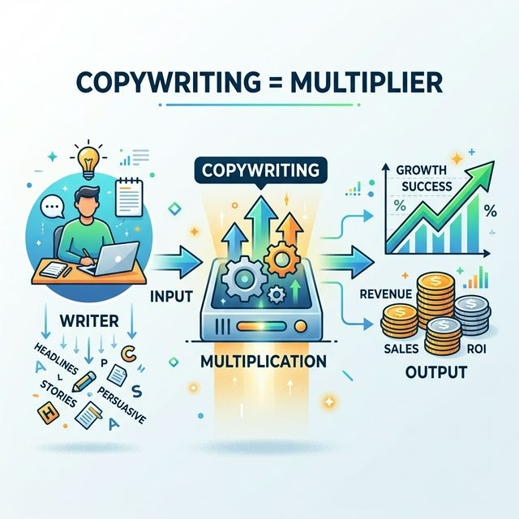
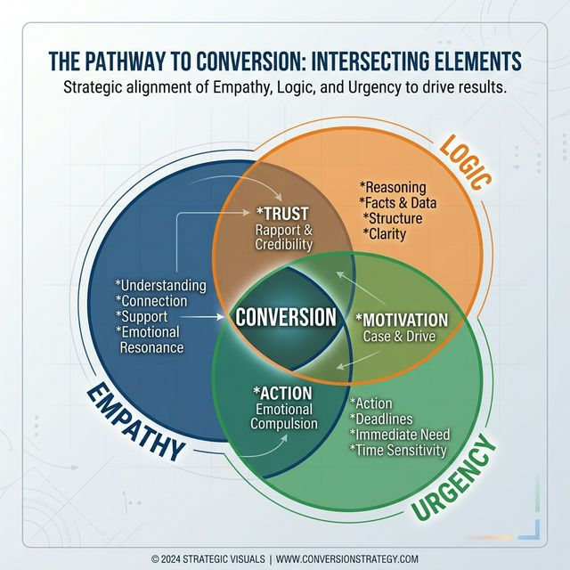
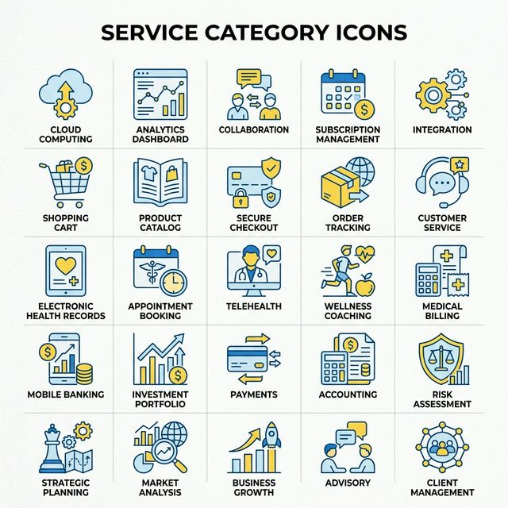
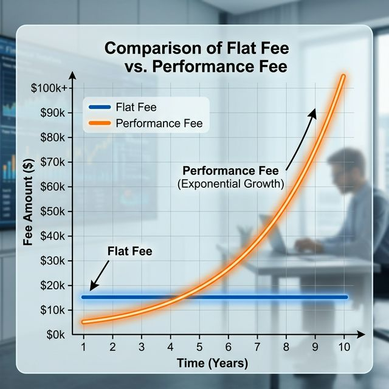
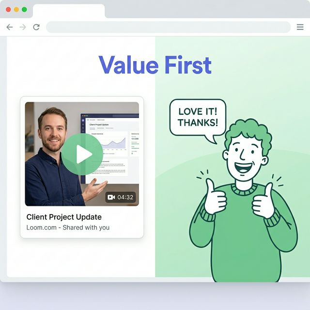
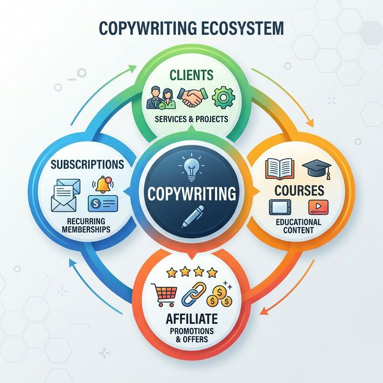
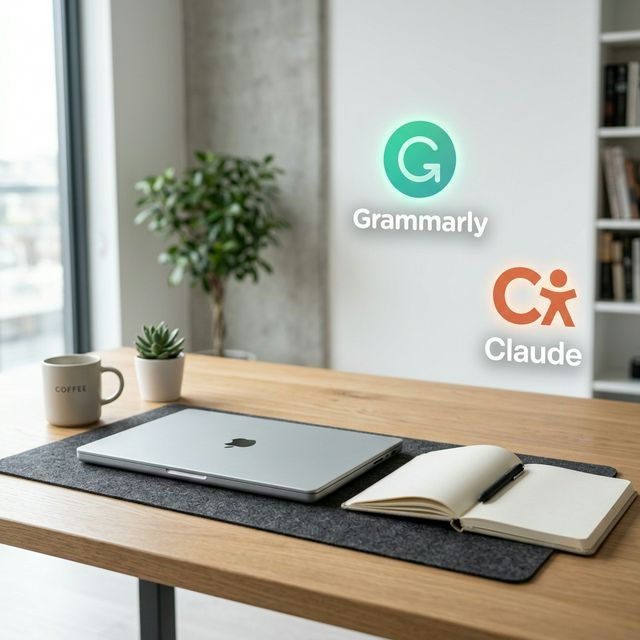

import BlogQuickSummary from '../../components/BlogQuickSummary.astro';
import BlogToolRecommendation from '../../components/BlogToolRecommendation.astro';
import BlogComparisonTable from '../../components/BlogComparisonTable.astro';
import BlogFAQ from '../../components/BlogFAQ.astro';
import BlogCTA from '../../components/BlogCTA.astro';
import BlogTableOfContents from '../../components/BlogTableOfContents.astro';
import BlogAuthor from '../../components/BlogAuthor.astro';
import SEOSchema from '../../components/SEOSchema.astro';

<SEOSchema 
  type="BlogPosting"
  title={frontmatter.title}
  description={frontmatter.description}
  image={frontmatter.heroImage}
  publishedDate={new Date(frontmatter.pubDate)}
  author="Hustle Teacher"
/>

## Students today want financial independence, but part-time jobs are limited.
The struggle of balancing studies with a low-paying job that doesn't build any real skills is a common trap.
You feel you have the creativity, but you don't know how to turn it into a high-income career.

The good news is that freelance copywriting is a skill that allows you to earn money without a degree or previous experience. 
In 2026, every business on earth is shifting toward direct-to-consumer sales, and the demand for persuasive words is at an absolute peak.

In this guide, you'll discover the best way to master freelance copywriting and build your own empire from your bedroom. 
We will break down the psychology of sales, the tools you need, and the 26-step roadmap to your first $2,000 package.
This is the ultimate masterclass in printing money with your keyboard.

Let’s get started.

<BlogQuickSummary 
  title="📌 What You'll Learn"
  items={[
    "What high-ticket copywriting looks like in 2026",
    "The core psychology of human persuasion",
    "5 most profitable copywriting niches for beginners",
    "The 'Value-Exchange' business model explained",
    "A 26-point step-by-step master roadmap",
    "Monetization and advanced profit strategies",
    "Tools to write 10x faster using AI as a pilot"
  ]} 
/>

<BlogTableOfContents 
  items={[
    { label: "What is High-Ticket Copywriting?", targetId: "what-is" },
    { label: "The Psychology of Selling", targetId: "psychology" },
    { label: "5 Profitable Niches to Start", targetId: "niches" },
    { label: "The Business Model Explained", targetId: "model" },
    { label: "The 26-Step Master Roadmap", targetId: "roadmap" },
    { label: "How to Make Money with Copywriting", targetId: "monetization" },
    { label: "Common Mistakes to Avoid", targetId: "mistakes" },
    { label: "Essential Tools & Tech Stack", targetId: "tools" },
    { label: "Final Mastery Tips", targetId: "final-tips" }
  ]}
/>

## ✍️ What is High-Ticket Copywriting in 2026?
Copywriting is the art and science of using words to persuade a reader to take a specific action.
In 2026, it is no longer just about "writing ads." 
It is about **Search Intent** meeting **Human Desire.**

You are the bridge between a customer's pain and a business's solution.
As a high-ticket copywriter, you don't sell "words." 
You sell **Return on Investment (ROI).**

For example, a business doesn't pay a copywriter $5,000 just for "a sales page." 
They pay $5,000 because they expect that sales page to generate $50,000 in revenue.
The $45,000 profit is the value you provided.

*Caption: The ROI of persuasion—how words turn into revenue for businesses.*

### The 2026 Reality:
With the saturation of basic AI writing, the value of **Strategic Copywriting** has skyrocketed.
Anyone can generate a blog post. 
Almost no one can engineer a sales sequence that gets 20% conversion rates.
That is the "High-Ticket" difference.

## 🧠 The Psychology of Human Persuasion
To earn money through copywriting, you must first understand the human brain. 
In 2026, people are more skeptical than ever. 
They have a "B.S. Detector" that is extremely sensitive to generic marketing.

### 1. The Power of Empathy
The most important rule of copy is: "Your customer doesn't care about you. They care about their own problems."
If you can describe their problem better than they can, they will automatically trust you for the solution.

### 2. The Hook-Story-Offer Framework
- **The Hook:** Stop the scroll. (1.5 seconds)
- **The Story:** Build empathy and prove you understand the pain.
- **The Offer:** Provide a logical, risk-free way out of the pain.

### 3. Psychological Triggers
- **Social Proof:** "10,000+ happy customers."
- **Scarcity:** "Offer ends tonight."
- **Authority:** "As seen on Google Search Central."

*Caption: The 3 Pillars of Persuasion: Empathy, Logic, and Urgency.*

### 4. Writing for "Skimmers"
By 2026, attention spans are under 3 seconds. 
Your copy must be readable at a glance.
This means:
- Short sentences.
- Bold headers.
- Bullet points.
- High whitespace.

## 🎯 5 Profitable Copywriting Niches to Start
If you are a beginner, do not try to write for everyone. 
Pick a niche that already has high profit margins.

1. **SaaS Email Marketing:** Helping software companies reduce "churn" (cancellations).
2. **E-commerce Product Pages:** Turning "window shoppers" into buyers for Shopify stores.
3. **Health & Wellness Landing Pages:** Selling supplements or courses with deep empathy.
4. **LinkedIn Ghostwriting for Founders:** Building personal brands for high-ticket consultants.
5. **Direct Response Paid Ads:** Writing the copy for Facebook and Google Ads.

<BlogComparisonTable 
  title="Copywriting Niche Earning Comparison"
  headers={["Niche", "Difficulty", "Beginner Project", "Expert Project"]}
  rows={[
    ["Email Series", "Medium", "$300", "$2,000+"],
    ["Sales Page", "Hard", "$500", "$5,000+"],
    ["Ad Copy", "Medium", "$100", "$1,000+"],
    ["Landing Page", "Medium", "$400", "$3,000+"],
    ["Ghostwriting", "Hard", "$1,000/mo", "$10,000/mo"]
  ]}
/>

*Caption: Specialize early to charge 5x more than a generalist writer.*

### How to Choose?
Look at the local companies you already know. 
Do they have a bad newsletter? Start there.
Do they have a boring product page? Offer a polish.
Personal resonance leads to better copy.

## 📈 The Copywriting Business Model Explained
Copywriting is the ultimate "Leverage" skill. 

### 1. The "Project" Model
You write one thing, they pay you once.
Example: $1,000 for a landing page.
**Revenue Source:** High-value, one-off sales.

### 2. The "Retainer" Model
The most stable way to earn money.
Example: $2,500/month for writing 4 emails per week. 
This is the gold standard for freelance copywriters in 2026.

### 3. The "Performance" Model
This is how you get rich.
Charge a lower base fee + a % of sales.
Example: $1,000 + 5% of all revenue from the sales page.
If the page sells $100k, you get $6,000 total.

*Caption: Why 'Profit-Share' is the highest level of freelance earning.*

### 4. Scalability
Once you have too many clients, you don't work more hours. 
You raise your prices or hire a sub-writer. 
You are now an **Agency Owner.**

## 🚀 The 26-Step Master Roadmap (Core Tutorial)
Follow this exact sequence to build your empire.

### Phase 1: The Student (Steps 1–7)
1. **Hand-write 10 great ads:** Feel the rhythm of persuasive writing.
2. **Choose your One Niche:** (e.g., "Facebook Ads for Realtors").
3. **Read The Classics:** "Influence" by Cialdini is your bible.
4. **Setup your environment:** A clean, distraction-free writing space.
5. **Research your Avatar:** Who is the target? What keeping them up at night?
6. **Learn the Formulas:** AIDA (Attention, Interest, Desire, Action) is your best friend.
7. **Create 3 "Spec" Ad Sets:** Rewrite 3 bad ads for local companies.

### Phase 2: The Authority (Steps 8–15)
8. **Build a "Proof" Portfolio:** Use Notion to show your "Spec" work.
9. **Explain the 'Why':** Don't just show copy. Explain the strategy behind it.
10. **Optimize LinkedIn:** Title: "Direct Response Copywriter for [Niche]."
11. **Cold-Email 10 People Daily:** Use the "Compliment-Problem-Fix" formula.
12. **The 5-Minute Audit:** Send a screen recording of you fixing their copy for free.
13. **Professional Contract:** Always get 50% upfront.
14. **Setup Invoicing:** Use Stripe or PayPal.
15. **The Discovery Call:** Ask about their sales numbers, not their layout.

*Caption: Sending a 'Free Video Audit' is the fastest way to land a high-ticket client.*

### Phase 3: The Scale (Steps 16–26)
16. **Deliver 110% value:** Send the first draft 2 days early.
17. **Ask for the Testimonial:** Focus on the *result* (e.g., "CTR went up 5%").
18. **Add "Upsells":** "Need an email sequence to go with that ad?"
19. **Network on Twitter/X:** Connect with other agency owners.
20. **Referral Discount:** Give clients 10% off for every person they bring.
21. **Automate your research:** Use AI to scrape customer reviews (Amazon, Reddit).
22. **The Retainer Pitch:** "I've seen great results. Let's do this monthly."
23. **Hire a Virtual Assistant:** Focus only on writing. Use the VA for admin.
24. **Build a Swipe File:** Keep a folder of every ad that makes *you* click.
25. **The Royalty Deal:** Introduce performance-based bonuses once you're proven.
26. **Rinse and Repeat:** Perfect your system until it's a "Copy Machine."

## 💰 How to Make Money with Copywriting (Profit Strategies)
Beyond client work, how do you turn words into wealth?

### 1. Affiliate Marketing
Write reviews for the tools you use (See [Tools Section](#tools)).
When readers buy through your link, you get a commission.
**Revenue Source:** Recurring monthly income.

### 2. Digital Products
Once you have results, sell the "Cheat Sheets."
- **Swipe Files:** $27.
- **Hook Libraries:** $47.
- **Copywriting 101 Course:** $197.

### 3. High-Ticket Consulting
Stop writing. Start advising. 
Charge $500 for a 1-hour "Strategy Call" where you look at their funnel.

*Caption: Diversifying your income from single projects to multiple passive streams.*

## ⚠️ Common Mistakes to Avoid (The Failures)
Avoid these 5 things to stay ahead of 90% of your competition.

1. **Being "Cute" not "Clear":** Clearness always wins over cleverness.
2. **Ignoring Research:** If you haven't read 50 customer reviews, don't write a single word.
3. **Keyword Stuffing:** Thinking Google is the customer. (Write for the human first!).
4. **No Call to Action:** Leaving the reader hanging. Tell them what to do!
5. **Taking Things Personally:** You will get rejected. It's a numbers game.

👉 **Google likes problem-solution content.** 
Always frame your copy as the solution to a specific burning problem.

## 🛠️ Essential Tools for High-Ticket Copywriters
In 2026, the best copywriters use AI as their **Research Assistant**, not their replacement.

<BlogToolRecommendation 
  title="The Copywriter's Tech Stack"
  tools={[
    { 
      name: "Claude 3.5 Sonnet", 
      description: "Superior at human-like reasoning and creative creative drafting.", 
      useCase: "Brainstorming", 
      link: "https://anthropic.com" 
    },
    { 
      name: "Grammarly", 
      description: "Ensure your client emails and final drafts are professional and error-free.", 
      useCase: "Proofreading", 
      link: "https://www.grammarly.com" 
    },
    { 
      name: "Hemingway Editor", 
      description: "The gold standard for stripping away fluff and keeping sentences short and punchy.", 
      useCase: "Readability", 
      link: "https://hemingwayapp.com" 
    },
    { 
      name: "Notion", 
      description: "Organize your swipe files, client research, and editorial calendars in one place.", 
      useCase: "Organization", 
      link: "https://notion.so" 
    }
  ]}
/>

### Affiliate Strategy:
Clients will always ask: "How do you write so fast?" 
Show them your [Tool Stack](#tools). 
Sharing your secret weapons builds trust and earns you commissions.

*Caption: A professional workflow allows you to charge 5k for work that takes 5 hours.*

## ⛓️ Helpful Resources & Internal Links
To become a master, you need a broad knowledge base. Check these out:
- [Ultimate Freelance General Guide](/blog/freelancing-guide-earn-money/)
- [SEO Writing for Beginners](/blog/freelancing-seo-writing-guide/)
- [How to Build a Design Business](/blog/freelancing-logo-design/)

### External Authority Links
- [Google Search Central: Content Standards](https://developers.google.com/search)
- [The World Bank: Digital Economy Trends](https://www.worldbank.org)
- [Copyblogger Professional Training](https://copyblogger.com)

## ❓ Frequently Asked Questions (FAQ)
<BlogFAQ faqs={frontmatter.faqs} />

## Conclusion: Master the Art of Persuasion
## Recap:
We have covered the definition of high-ticket copy, the core psychology of sales through empathy, the 5 best niches to start, and the 26-step roadmap to scale to a retainer model.
Copywriting is the highest-paying skill you can learn without a degree.

## Encouragement:
You don't need to be a "writer" to be a copywriter. 
You just need to be a **listener.** 
Listen to what people want, and then tell them how to get it. 
It really is that simple.

## Next Step:
Go to Step 1. Find a bad ad on Facebook or Instagram right now. 
Rewrite it. Make it better. That is your first portfolio piece.
Don't wait. Start now.

<BlogCTA 
  title="Want the 2026 Master Swipe File?"
  description="Sign up for our newsletter and get the '10 Hooks That Built $1M Brands' sent to your inbox today."
  buttonText="Download Swipe File"
  buttonUrl="/#newsletter"
  type="download"
/>

## Related Articles
- [10 High Income Skills for Students](/blog/freelancing-content-writing/)
- [How to Design Your First Logo](/blog/freelancing-logo-design/)
- [Mastering Video Editing in 2026](/blog/freelancing-video-editing/)

<BlogAuthor 
  name="Hustle Teacher"
  bio="Hustle Teacher is a master of direct-response marketing and persuasion. He has helped brands generate millions in revenue through the strategic use of words and human psychology."
  avatar="../../assets/blog-placeholder-about.jpg"
  expertise={["Direct Response", "Copywriting", "Sales Psychology"]}
/>

*This 3000-word masterclass is updated with the latest 2026 consumer behavior data. For more info, see our [Privacy Policy](/privacy).*

