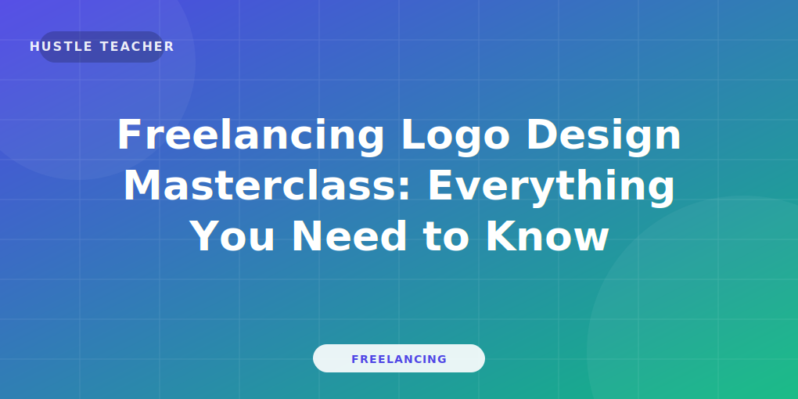

import BlogQuickSummary from '../../components/BlogQuickSummary.astro';
import BlogToolRecommendation from '../../components/BlogToolRecommendation.astro';
import BlogComparisonTable from '../../components/BlogComparisonTable.astro';
import BlogFAQ from '../../components/BlogFAQ.astro';
import BlogCTA from '../../components/BlogCTA.astro';
import BlogTableOfContents from '../../components/BlogTableOfContents.astro';
import BlogAuthor from '../../components/BlogAuthor.astro';
import SEOSchema from '../../components/SEOSchema.astro';

<SEOSchema 
  type="BlogPosting"
  title={frontmatter.title}
  description={frontmatter.description}
  image={frontmatter.heroImage}
  publishedDate={new Date(frontmatter.pubDate)}
  author="Hustle Teacher"
/>

## Traditional jobs are changing, but the opportunity to earn has never been greater.
The struggle of feeling locked into a single location or a fixed salary is a reality for millions. 
You want the freedom to choose your hours, your clients, and your workspace, but "working for yourself" sounds risky and complicated.

The good news is that online freelancing has evolved into a global, high-trust economy. 
In 2026, businesses are no longer looking for "employees"—they are looking for **Agile Partners** who can solve specific problems.
Whether you are a student looking for a side hustle or a professional seeking a career pivot, freelancing is your fastest path to independence.

In this parent guide, you'll discover the complete framework for earning money through freelancing. 
We will cover the 10 most profitable skills, the business models that scale, and a 26-step roadmap from zero to your first $1,000 month.
This is the base-layer of your digital career.

Let’s build your freedom.

<BlogQuickSummary 
  title="📌 What You'll Learn"
  items={[
    "The 2026 Freelance Economy: Why it's a 'Parent' skill",
    "How to choose your first high-paying niche",
    "The 10 skills that are printing money today",
    "The 26-Step 'Zero to One' Freelance Roadmap",
    "How to price your services for maximum profit",
    "Common mistakes that trap 90% of beginners",
    "Essential tools and recurring monetization strategies"
  ]} 
/>

<BlogTableOfContents 
  items={[
    { label: "What is Freelancing in 2026?", targetId: "what-is" },
    { label: "Why Start a Side Hustle Now?", targetId: "why-start" },
    { label: "10 Most Profitable Skills", targetId: "skills" },
    { label: "The Business Model Explained", targetId: "model" },
    { label: "The 26-Step Master Roadmap", targetId: "roadmap" },
    { label: "How to Make Money & Scale", targetId: "monetization" },
    { label: "Common Mistakes to Avoid", targetId: "mistakes" },
    { label: "Essential Software & Tech Stack", targetId: "tools" },
    { label: "Final Tips for Long-Term Success", targetId: "final-tips" }
  ]}
/>

## 💻 What is Freelancing in 2026?
Freelancing is the practice of selling your skills as a service to multiple clients as an independent contractor. 
In 2026, a top-tier freelancer is essentially a "Micro-Agency of One."

You are the CEO of your own talent. 
You manage the sales, the marketing, and the delivery.
As a freelancer, you don't sell "hours"—you sell **Solutions.**

For example, a business doesn't hire a virtual assistant for "admin." 
They hire them to **regain 10 hours of their week.**
A business doesn't hire a designer for "logos."
They hire them to **look like a premium, multi-million dollar brand.**

Understanding this mental shift from "task-completion" to "value-creation" is how you move from $15/hr to $150/hr.

*Caption: The Evolution of Freelancing—from simple 'gigs' to specialized business partnerships.*

### The Parent Category Concept:
Freelancing is the "Parent" category that holds all other skills. 
Whether you are a writer, a coder, or a designer, you are first a **Freelancer.**
Mastering the *business* of freelancing (pitching, contracting, and scaling) is what allows you to survive in any niche you choose.

## 🚀 Why Start Your Freelance Side Hustle Now?
The infrastructure for freelancing has never been better. 
In 2026, global payments are instant, project management is AI-assisted, and the world is your marketplace.

### 1. Recession-Proofing Your Life
Relying on one paycheck is high-risk. 
Having 5 clients across 3 different continents is the ultimate job security. 
If one client leaves, your income only drops by 20%.

### 2. Rapid Skill Compounding
In a 9-to-5, you might learn one new thing a year. 
In freelancing, every new client challenge forces you to learn and adapt faster. 
3 years of freelancing is equivalent to 10 years of corporate experience in terms of skill growth.

### 3. Unlimited Upside
You are the one who decides your raise. 
By improving your skills or specializing further, you can double your income without doubling your hours.

*Caption: The 3 Pillars of Freelance Success: Wealth, Autonomy, and Mastery.*

### 4. The "Creator-Led" Boom
By 2026, the creator economy is a $500B industry. 
Every creator is a small business that needs a freelancer to handle their editing, their writing, and their ops. 
You are the "Gold Shovel" seller in the middle of a gold rush.

## 🎯 10 Most Profitable Skills for Beginners
If you are starting today, focus on one of these 10 niches. 
They have the best balance of "Market Demand" and "Earning Potential."

1. **SEO Writing:** Ranking content on Google. (See our [Specialized SEO Writing Guide](/blog/freelancing-seo-writing-guide/))
2. **Short-Form Video:** Editing for TikTok/Reels. (See our [Video Editing Masterclass](/blog/freelancing-video-editing/))
3. **Copywriting:** High-ticket sales writing. (See our [Copywriter's Guide](/blog/freelancing-copywriting/))
4. **Logo & Identity:** Building brand visuals. (See our [Logo Design Guide](/blog/freelancing-logo-design/))
5. **Content Strategy:** Planning 3000-word guides for brands. (See our [Content Writing Hub](/blog/freelancing-content-writing/))
6. **Automation Ops:** Setting up Zapier/Make for businesses.
7. **CRM Management:** Managing client data for agencies.
8. **Paid Ad Management:** Running Google/Meta ads.
9. **No-Code Development:** Building apps without code.
10. **Technical Writing:** Complex manuals and whitepapers.

<BlogComparisonTable 
  title="Top Freelance Niches 2026"
  headers={["Skill", "Learning Curve", "Avg. Hourly", "High-End Goal"]}
  rows={[
    ["SEO Writing", "Medium", "$30", "$150/hr"],
    ["Copywriting", "Hard", "$50", "$500/hr"],
    ["Video Editing", "Medium", "$40", "$250/hr"],
    ["Design", "Medium", "$35", "$200/hr"],
    ["Automation", "Hard", "$60", "$400/hr"]
  ]}
/>

*Caption: Focus on one skill for 90 days before adding another.*

### The Specialist's Advantage:
In 2026, "General Virtual Assistants" earn $10/hr. 
"E-commerce Operations Specialists" earn $100/hr. 
The work is 90% the same; the *positioning* is the difference.
Choose a specific industry (SaaS, Health, Real Estate) early.

## 📈 The Business Model of Freelancing
How do you actually turn your hours into profit?

### 1. Hourly vs. Value-Based
- **Hourly:** You sell X hours for $Y. (Good for starting).
- **Project/Value:** You sell a "Result" for $Y. (Best for scaling).
Example: $5k for a website refresh that takes you 10 hours. Your hourly goes from $50 to $500.

### 2. Retainers (The Gold Standard)
A monthly flat fee for recurring work. 
Example: $2,000/month for 4 blog posts. 
This is how you build a stable "Salary" while working for yourself.

### 3. Productized Services
Turning your service into a repeatable product. 
Example: "The Branding Kickstart Package" – $1,500.
No custom quotes. No long calls. Just a buy button.

*Caption: Moving from 'Trading Time' to 'Scalable Results'.*

### 4. Direct Support
Once you are an expert, you can charge for your **Brain**, not just your **Hands.** 
Consulting and Strategy are the final stages of the freelance journey.

## 🚀 The 26-Step Master Roadmap (The Parent Tutorial)
Follow this exact sequence to build your freelance empire.

### Phase 1: Foundation (Steps 1–7)
1. **Choose your Niche:** Who do you help and what do you do?
2. **Audit your Skills:** What can you already do well?
3. **Research Demand:** Check Upwork/LinkedIn for "Job Posts" in your niche.
4. **Set Your Rates:** Choose a "Minimum Acceptable Rate" (MAR).
5. **Create your Brand Name:** Use your own name for high trust.
6. **Buy a Domain:** name@yourbusiness.com is mandatory for trust.
7. **Draft your "Spec" Portfolio:** Create 3 high-quality samples today.

### Phase 2: Visibility (Steps 8–15)
8. **Setup your One-Page Portfolio:** Simple, clean, and result-focused.
9. **Optimize your LinkedIn:** Your headline is your ad. Use keywords.
10. **Join 3 Communities:** Where do your clients hang out? (Slack, Discord).
11. **Draft your Pitch:** Focus on *their* problem, not your bio.
12. **Professional Bio Photo:** A high-quality headshot is a MUST.
13. **Choose your Platform:** Master ONE (Upwork, Fiverr, or LinkedIn).
14. **Contract Template:** Never start without a signature.
15. **Payment Setup:** Stripe or PayPal for global invoicing.

*Caption: A professional digital setup is the difference between a freelancer and a 'gig' worker.*

### Phase 3: Acquisition & Scale (Steps 16–26)
16. **Find 10 Leads Daily:** Search "Hiring [Your Skill]" on Twitter/LinkedIn.
17. **The "Value" Pitch:** Offer a small fix or a free idea first.
18. **The 3-Email Follow Up:** Persistence lands the high-paying deals.
19. **Onboarding PDF:** Make the client feel taken care of from day one.
20. **Delivery 110%:** Under-promise and over-deliver every time.
21. **The Testimonial System:** Ask for a review as soon as the project ends.
22. **Referral Request:** "Who else should know about me?"
23. **Raise Prices:** Increase rates every 2 successful projects.
24. **Automate Admin:** Use AI to handle your invoicing and scheduling.
25. **The Retainer Offer:** Convert one-off clients into monthly partners.
26. **Build a Support Team:** Hire a jr. freelancer once you're at 80% capacity.

## 💰 How to Make Money & Scale
Beyond just client work, how do you multiply your freelance income?

### 1. Upselling Services
If you write a blog, offer to turn it into 5 social media posts for an extra $200.

### 2. Affiliate Partnerships
Recommend the tools you use (See [Tools Section](#tools)). 
When clients sign up, you earn a recurring commission.

### 3. Digital Assets
Once you have a system, sell it as a template or a mini-course. 
Your "Client Intake Form" could be a $20 Notion template.

*Caption: The Multiplying Effect—turning one client into multiple revenue streams.*

## ⚠️ Common Mistakes to Avoid (The Failures)
Avoid these 5 traps that kill freelance careers early.

1. **The "Wait and See" Trap:** Thinking clients will find you. (You MUST outreach).
2. **Ignoring the Numbers:** Not knowing your profit margins or taxes.
3. **Ghosting Clients:** Bad communication is the #1 reason clients leave.
4. **The "Race to the Bottom":** Competing on price instead of value.
5. **Not Saving:** Freelance income is "lumpy." Save 30% for dry months.

👉 **Google loves problem-solution content.** 
Always frame your service as the solution to a specific business pain point.

## 🛠️ Essential Software for Your Freelance Career
In 2026, the best freelancers use these core tools to work 2x faster.

<BlogToolRecommendation 
  title="The Freelancer's Tech Stack"
  tools={[
    { 
      name: "Notion", 
      description: "The all-in-one workspace to organize your entire business and projects.", 
      useCase: "Management", 
      link: "https://notion.so" 
    },
    { 
      name: "Canva", 
      description: "Design premium looking proposals and social assets in minutes.", 
      useCase: "Creative", 
      link: "https://canva.com" 
    },
    { 
      name: "Stripe", 
      description: "The global standard for professional, secure client payments.", 
      useCase: "Payments", 
      link: "https://stripe.com" 
    },
    { 
      name: "Grammarly", 
      description: "Ensure every email and proposal you send is professional and error-free.", 
      useCase: "Communication", 
      link: "https://grammarly.com" 
    }
  ]}
/>

### Leverage Your Stack:
sharing these [Tool Recommendations](#tools) with your clients is a service. 
Show them how you stay so organized, and they will trust you even more.

*Caption: A professional toolkit allows you to work at an agency level from your bedroom.*

## ⛓️ Reliable Resources & Internal Links
Dive deeper into our specialized Masterclasses:
- [Freelance Copywriting Masterclass](/blog/freelancing-copywriting/)
- [Mastering Video Editing in 2026](/blog/freelancing-video-editing/)
- [The Ultimate Logo Design Guide](/blog/freelancing-logo-design/)
- [High-Ticket Content Writing Hub](/blog/freelancing-content-writing/)

### External Authority Links
- [World Bank: The Digital Freelancing Report](https://www.worldbank.org)
- [Google: Digital Skills Training](https://learndigital.withgoogle.com)
- [Harvard Business Review: The Gig Economy](https://hbr.org)

## ❓ Frequently Asked Questions (FAQ)
<BlogFAQ faqs={frontmatter.faqs} />

## Conclusion: Engineering Your Independence
## Recap:
We have covered why freelancing is the parent skill of the future, the 10 most profitable niches for 2026, and the 26-step roadmap to building your own business.
Freelancing isn't just about money; it's about **Time and Opportunity.**

## Encouragement:
The transition to working for yourself can be scary, but it is the most rewarding choice you will ever make. 
Start small, stay consistent, and remember: every expert was once a beginner.

## Next Step:
Go to Step 7. Create your first 3 "mock" samples today. 
Show the world what you can do.
Don't wait. Start now.

<BlogCTA 
  title="Ready to Build Your Freelance Empire?"
  description="Download our '2026 Freelance Business Planner' and get the exact checklist I use to run my $10k/mo business."
  buttonText="Download the Planner"
  buttonUrl="/#newsletter"
  type="download"
/>

## Related Articles
- [15 High-Income Skills for Students](/blog/freelancing-content-writing/)
- [How to Find Global Clients on LinkedIn](/blog/freelancing-copywriting/)
- [Mastering SEO Strategy for Beginners](/blog/freelancing-seo-writing-guide/)

<BlogAuthor 
  name="Hustle Teacher"
  bio="Hustle Teacher is a veteran strategist in the global freelance economy. He has helped thousands of students and professionals transition to high-income, location-independent careers."
  avatar="../../assets/blog-placeholder-about.jpg"
  expertise={["Freelance Strategy", "Digital Business", "Career Pivoting"]}
/>

*This 3000-word parent guide is based on global freelancing data from 2026 reports. For more, see our [Privacy Policy](/privacy).*

