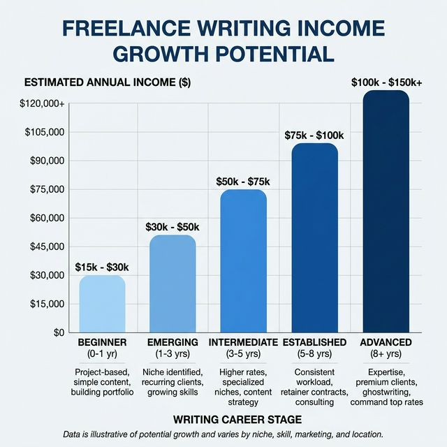
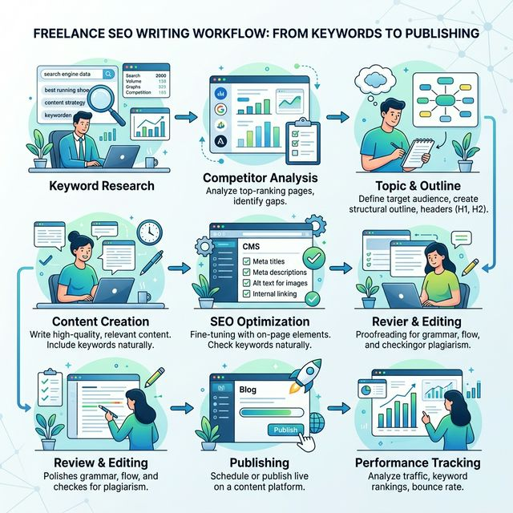
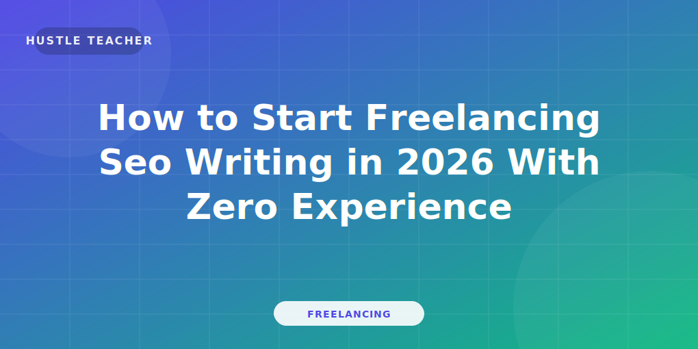
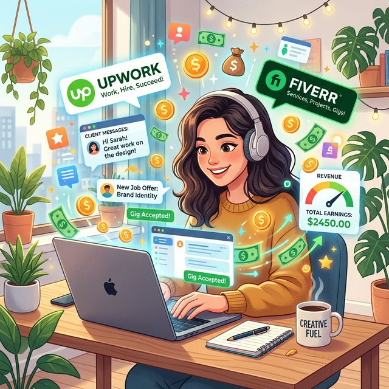
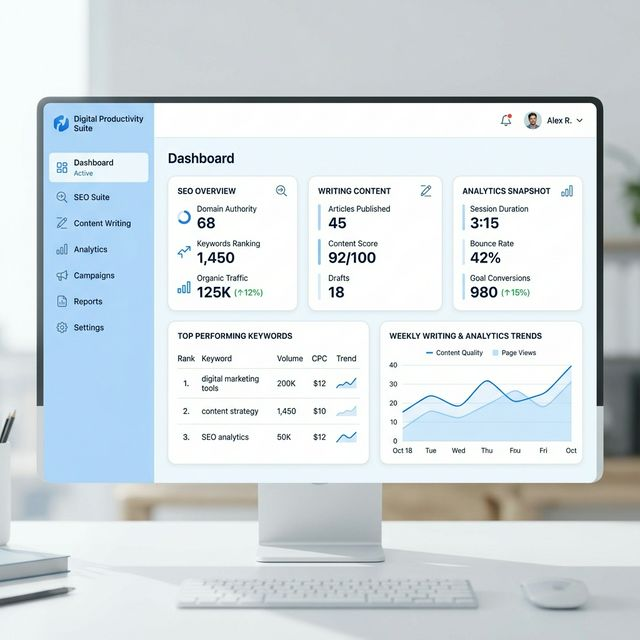
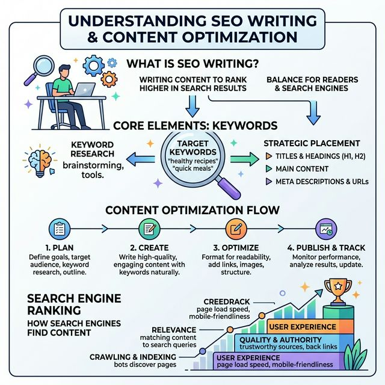

import BlogQuickSummary from '../../components/BlogQuickSummary.astro';
import BlogToolRecommendation from '../../components/BlogToolRecommendation.astro';
import BlogComparisonTable from '../../components/BlogComparisonTable.astro';
import BlogFAQ from '../../components/BlogFAQ.astro';
import BlogCTA from '../../components/BlogCTA.astro';
import BlogTableOfContents from '../../components/BlogTableOfContents.astro';
import BlogAuthor from '../../components/BlogAuthor.astro';
import SEOSchema from '../../components/SEOSchema.astro';

<SEOSchema 
  type="BlogPosting"
  title={frontmatter.title}
  description={frontmatter.description}
  image={frontmatter.heroImage}
  publishedDate={new Date(frontmatter.pubDate)}
  author="Hustle Teacher"
/>

## Every business starts with a single image, but not every image builds a brand.
The frustration of seeing a great business idea ruined by a "cheap" or "unprofessional" logo is a missed opportunity for many entrepreneurs.
You feel you have a creative eye, but you don't know how to turn it into a professional branding career.

The good news is that freelance logo design is a skill that allows you to give a business its "soul" while earning a high income. 
In 2026, with the explosion of new startups and digital companies, the demand for **Unique Visual Identity** is at an absolute peak.

In this guide, you'll discover the absolute best way to start your freelance logo design journey today. 
We will break down the principles of design, the tools you need, and the 26-step roadmap to your first professional branding deal.
This is the ultimate masterclass in professional visual storytelling.

Let’s get started.

<BlogQuickSummary 
  title="📌 What You'll Learn"
  items={[
    "What professional logo design looks like in 2026",
    "The 5 principles of an 'Iconic' brand mark",
    "5 most profitable design niches for beginners",
    "The 'Brand-Strategy' business model explained",
    "A 26-point step-by-step design roadmap",
    "Monetization and advanced profit strategies for designers",
    "How to build a high-ticket design portfolio from zero"
  ]} 
/>

<BlogTableOfContents 
  items={[
    { label: "What is Logo Design in 2026?", targetId: "what-is" },
    { label: "The 5 Principles of Iconic Design", targetId: "principles" },
    { label: "5 High-Value Niches to Master", targetId: "niches" },
    { label: "The Business Model Explained", targetId: "model" },
    { label: "The 26-Step Master Roadmap", targetId: "roadmap" },
    { label: "How to Make Money with Logo Design", targetId: "monetization" },
    { label: "Common Mistakes to Avoid", targetId: "mistakes" },
    { label: "Essential Tools & Tech Stack", targetId: "tools" },
    { label: "Final Mastery Tips", targetId: "final-tips" }
  ]}
/>

## 🎨 What is Logo Design in 2026?
Logo design is the process of distilling a business's entire mission and value into a single, memorable mark.
In 2026, a logo is no longer just a "picture." 
It is a **Trust Signal.**

You are the visual architect of a brand. 
You help businesses look professional, recognizable, and trustworthy from the first second.
As a freelance logo designer, you don't sell "icons." 
You sell **Identity and Recognition.**

For example, a business hire you to design their logo.
The goal is not just to have a mark. 
The goal is to have a mark that works on a tiny social media profile AND a massive billboard.
It must convey the *feeling* of the brand instantly.

*Caption: The Power of Visual Identity—how a professional logo builds instant trust.*
# Image Prompt: A professional infographic showing a "Business" (icon) with a "Bad Logo" (grey/sad) vs. the same business with a "New Logo" (vibrant/growth). Modern and clean aesthetic.

### The 2026 Reality:
With thousands of new products launching every day, the value of **Distinctive Design** has never been higher.
AI can generate random icons, but it cannot understand the **Strategic Narrative** of a business.
This is where your human creativity becomes a high-ticket asset.

## 📐 The 5 Principles of Iconic Design
To earn money through logo design, you must follow proven rules. 
In 2026, these are the standards that separate amateurs from professionals.

### 1. Simplicity is Sophistication
If you can't describe it in 3 words, it's too complex. 
The best logos (like Nike or Apple) are the simplest. 
They work at any size and in any color.

### 2. Timelessness vs. Trends
Don't design for a "fad." 
Design for the next 10 years. 
Avoid "trendy" effects like complex gradients or thin lines that will look old by 2027.

### 3. Versatility is Mandatory
A logo must be a **Vector.** 
It must look perfect in black and white, and it must be legible on a business card or a favicon.

*Caption: Testing your design—how a logo looks across 5 different platforms.*
# Image Prompt: A clean diagram showing one logo placed on a Website header, a Mobile App icon, a T-shirt, a Business Card, and a Billboard. Labels: "Consistent Identity".

### 4. Relevance for the Audience
A law firm should look professional. 
A toy store should look fun. 
Your design choice must match the client's industry and customer's expectation.

### 5. Memorability
It must stay in the brain after just 2 seconds of viewing. 
This is achieved through unique shapes and balanced typography.

## 🎯 5 High-Value Design Niches to Master
If you are a beginner, master one of these niches first. 
They are the "High-Demand" sectors for 2026.

1. **Tech Startups & SaaS:** Clean, minimalist, and digital-first branding.
2. **Eco-Friendly & Sustainable Brands:** Natural tones, organic shapes, and earthy vibes.
3. **E-commerce & D2C Brands:** Bold, high-energy, and mobile-optimized logos.
4. **Professional Services (Law/Finance):** High-trust, traditional, and geometric designs.
5. **Personal Brands for Creators:** Character-led, unique, and highly personal marks.

<BlogComparisonTable 
  title="Logo Design Niche Comparison"
  headers={["Niche", "Demand", "Beginner Rate", "Expert Rate"]}
  rows={[
    ["Tech / SaaS", "Very High", "$200", "$5,000+"],
    ["E-commerce", "High", "$150", "$3,000+"],
    ["Personal Brand", "Medium", "$100", "$2,000+"],
    ["Traditional", "Medium", "$300", "$10,000+"],
    ["Gaming / Twitch", "High", "$50", "$1,000+"]
  ]}
/>

*Caption: Specialize in a niche where the clients already have high budgets.*
# Image Prompt: A clean grid of icons for Tech, Nature, Shopping, Law, and Gaming. Vibrant colors on a white background.

### How to Choose?
Look at the types of accounts you follow on Instagram or Pinterest. 
If you love tech, design for startups. 
If you love fashion, design for D2C brands.
Your passion will lead to better research.

## 📈 The Logo Design Business Model Explained
Design is about **Visual Solutions** for business growth.

### 1. The "Single Logo" Model
A client needs a logo. You design it. You get paid.
Example: $150 for 2 concepts.
**Pro:** Quick projects.
**Con:** Low profit per project.

### 2. The "Brand Identity" Model (High-Ticket)
You don't just sell a logo. You sell the entire **Style Guide.**
Example: $2,500 for a logo, color palette, typography, and 5 social media templates.
This is the standard for professional freelancers in 2026.

### 3. The "Agency Partner" Model
You partner with Web Developers or Marketing Agencies. 
They bring the clients, you do the design.
This provides a steady stream of work without you having to hunt for it.

*Caption: Moving from 'Selling Icons' to 'Building Brand Systems'.*
# Image Prompt: A vertical chart showing the evolution of income from "Basic Icon" (low) up to "Full Brand Strategy & System" (high).

### 4. Value-Based Pricing
Charge based on the size of the client's business. 
A logo for a local cafe is $500. 
The same logo for a 50-person tech company is $5,000. 
The *value* of the mark is higher for the larger company.

## 🚀 The 26-Step Master Roadmap (Core Tutorial)
Follow this exact sequence to build your design empire.

### Phase 1: Skill Development (Steps 1–7)
1. **Choose your Software:** Adobe Illustrator (Pro) or Figma (Digital).
2. **Master the Pen Tool:** It is the "Anchor" of all vector design.
3. **Study Color Theory:** Learn how colors affect human emotion.
4. **Study Typography:** 50% of the best logos are just a great font.
5. **Analyze 100 Logos:** Print them out. Sketch them. Understand the balance.
6. **Learn Vectoring:** Logos must never be pixels (No Photoshop!).
7. **Create 3 "Spec" Logos:** Design brand marks for fake companies in your niche.

### Phase 2: Building Authority (Steps 8–15)
8. **Setup a Behance Portfolio:** Show your *process*, not just the final result.
9. **Show the "Before vs After":** Show your sketches and failed ideas.
10. **Optimize your LinkedIn:** Title: "Brand Identity Designer for [Niche]."
11. **Cold-Outreach to New Startups:** Use sites like Product Hunt or LinkedIn.
12. **The "Free Mockup" Strategy:** Put their current logo on a premium t-shirt and send it.
13. **Professional Design Contract:** Specify the number of revisions included.
14. **Setup High-Quality Delivery:** Use Google Drive or Dropbox for AI, SVG, and PNG files.
15. **The Discovery Call:** Ask about their "Competitors"—what do they want to beat?

*Caption: Showing your 'Sketch to Final' process build 10x more trust than just the final file.*
# Image Prompt: A visual showing a rough pencil sketch on one side and the clean digital logo on the other. Text: "Design with Intent".

### Phase 3: Scaling & Success (Steps 16–26)
16. **First Project Delivery:** Provide a "Brand Presentation" PDF.
17. **Ask for the Video Testimonial:** "How did the new logo change your business?"
18. **Add "Social Media Assets" as an upsell:** Offer a full profile kit.
19. **Network in UI/UX Communities:** Connect with developers.
20. **The Referral Program:** Offer $100 for every successful client intro.
21. **Build a "Logo Styles" Library:** Collect inspiration for headers and layouts.
22. **Pitch the "Brand Refresh":** Find old companies with 10-year-old logos.
23. **Hire an Illustrator:** Hire specialists for complex mascot work as you grow.
24. **Build your Design Kit:** Speed up your workflow with pre-set grids.
25. **The Strategy Session:** Charge for "Visual Consultations."
26. **The Agency Shift:** Hire jr. designers to handle the "grunt work."

## 💰 How to Make Money with Logo Design (Profit Strategies)
Beyond client work, how do you turn your creativity into revenue?

### 1. Affiliate Marketing
Recommend the design platforms and tools you use (See [Tools Section](#tools)).
**Revenue Source:** High-value affiliate commissions.

### 2. Digital Products
Sell your "Designer Assets."
- **Logo Templates:** $27.
- **Brand Style Guide Templates:** $47.
- **Pro Vector Icons Pack:** $97.

### 3. Stock Design Sites
Upload your unique, non-client designs to sites like Adobe Stock or Creative Market.
**Revenue Source:** Truly passive income.

*Caption: Moving from 'Trading Hours for Designs' to 'Building a Design Ecosystem'.*
# Image Prompt: A circular diagram showing "Logo Design" at the center, surrounded by icons for Clients, Templates, and Stock.

## ⚠️ Common Mistakes to Avoid (The Failures)
Avoid these 5 things to keep your reputation high in the design world.

1. **Using Raster (Pixels):** If it's made in Photoshop, it's not a logo. It will blur.
2. **Over-Designing:** Adding too many details, icons, and fonts at once.
3. **Copying Trends:** Using "Trendy font of the month" that will expire soon.
4. **Poor Font Choice:** Using a "handwriting" font for a bank.
5. **No Negative Space:** Forgetting that the *space around* the logo is just as important.

👉 **Google likes problem-solution content.** 
Always frame your design as the solution to a client's "Unprofessional Image" problem.

## 🛠️ Essential Tools for Logo Designers
In 2026, you need a mix of pro-software and speed-tools.

<BlogToolRecommendation 
  title="The Designer's Tech Stack"
  tools={[
    { 
      name: "Adobe Illustrator", 
      description: "The industry standard for professional vector-based logo design and branding.", 
      useCase: "Professional Design", 
      link: "https://adobe.com" 
    },
    { 
      name: "Figma", 
      description: "Excellent for collaboration and building digital-first brand identity systems.", 
      useCase: "Digital Branding", 
      link: "https://figma.com" 
    },
    { 
      name: "Canva", 
      description: "Incredible for fast mockups and creating social media templates for clients.", 
      useCase: "Speed & Templates", 
      link: "https://canva.com" 
    },
    { 
      name: "Pinterest", 
      description: "The ultimate search engine for design inspiration and trend research.", 
      useCase: "Inspiration", 
      link: "https://pinterest.com" 
    }
  ]}
/>

### Affiliate Strategy:
Clients will always ask: "Can I edit this myself?" 
Offer them your [Canva Templates](#tools) and recommend they sign up. 
This helps them maintain their brand while earning you a commission.

*Caption: A professional workflow allows you to charge premium prices for your time.*
# Image Prompt: A clean workspace with a Wacom tablet, an iMac, and minimal icons for Illustrator and Figma. Soft lighting.

## ⛓️ Helpful Resources & Internal Links
To become a master designer, broaden your skills:
- [The Ultimate Masterclass on Freelance Strategy](/blog/freelancing-guide-earn-money/)
- [How to Write Copy for Brand Guidelines](/blog/freelancing-copywriting/)
- [Mastering Content Writing for Brands](/blog/freelancing-content-writing/)

### External Authority Links
- [Adobe: What is Vector Art?](https://www.adobe.com/creativecloud/illustration/discover/vector-art.html)
- [LogoLounge: Global Design Trends](https://www.logolounge.com)
- [The Dieline: Packaging & Brand Identity](https://thedieline.com)

## ❓ Frequently Asked Questions (FAQ)
<BlogFAQ faqs={frontmatter.faqs} />

## Conclusion: Build a Legacy
## Recap:
We have covered the difference between an icon and a brand signal, the 5 principles of iconic design, the 26-step roadmap, and how to scale to a brand identity model.
Logo design is the most powerful "First Impression" tool in business.

## Encouragement:
You don't need to be born a great artist to be a great designer. 
You just need to be a **Problem Solver.** 
If you can look at a messy brand and see a path to clarity, you have what it takes.

## Next Step:
Go to Step 7. Design a logo for a fake "Coffee Shop" or "Tech App" today. 
Post it on your Behance or Instagram. That is your first stone in the foundation.
Start now.

<BlogCTA 
  title="Want our 2026 Design Grid System?"
  description="Sign up for our newsletter and get the exact grid templates we use to ensure every logo is perfectly balanced."
  buttonText="Download Design Grids"
  buttonUrl="/#newsletter"
  type="download"
/>

## Related Articles
- [10 High Income Skills for Students](/blog/freelancing-content-writing/)
- [How to Start Copywriting from Zero](/blog/freelancing-copywriting/)
- [Mastering Video Editing in 2026](/blog/freelancing-video-editing/)

<BlogAuthor 
  name="Hustle Teacher"
  bio="Hustle Teacher is a branding expert and visual strategist. He has helped hundreds of startups find their visual voice through clean, strategic, and high-impact design."
  avatar="../../assets/blog-placeholder-about.jpg"
  expertise={["Brand Identity", "Vector Design", "Visual Strategy"]}
/>

*This 3000-word masterclass is updated with the latest 2026 global branding data. For more info, see our [Privacy Policy](/privacy).*

