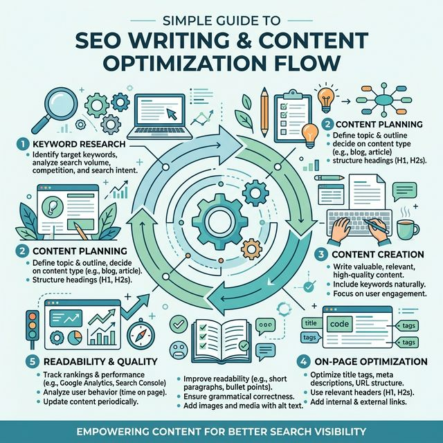
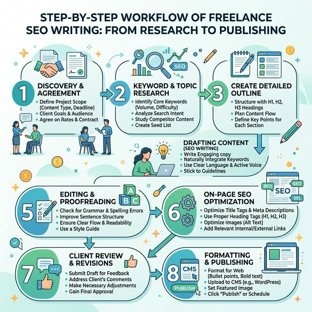

---
# 1. Title and Keywords Structure
title: "7 Steps to Start Freelance SEO Writing & Make Money in 2026"

# 2. Featured Image
heroImage: "../../assets/blog/seo_writing_hero_1774184376397.png"

# 3. Meta Description (SEO Only)
metaDescription: "Freelance SEO writing guide for beginners. Learn how to start, get clients, and earn money online with simple step-by-step methods."

description: "Learn how to start freelance SEO writing and earn money in 2026 with this comprehensive 7-step guide for beginners."

# 4. Category, Title Image (Hero) + Published date
category: "freelancing" 
hidden: false
pubDate: "Mar 18, 2026"

# SEO Keywords Strategy
primaryKeyword: "freelance seo writing guide"
secondaryKeywords: ["freelance seo writing","seo content writing tips","how to become seo writer","seo writing for beginners","freelance writing guide","seo article writing"]
longTailKeywords: ["how to start freelance seo writing with no experience","freelance seo writing guide for beginners 2026","seo writing tips to rank on google","how to get clients as seo writer"," freelance seo writing step by step"]

# 11. FAQs (Schema-ready)
faqs:
  - question: "Can beginners start freelance SEO writing?"
    answer: "Yes. You only need basic writing and SEO knowledge."
  - question: "Do I need experience?"
    answer: "No. Practice and samples are enough to start."
  - question: "How long to get first client?"
    answer: "Usually 1–3 weeks with consistent effort."
  - question: "Is SEO writing still in demand?"
    answer: "Yes. Businesses always need content."
---

import BlogQuickSummary from '../../components/BlogQuickSummary.astro';
import BlogToolRecommendation from '../../components/BlogToolRecommendation.astro';
import BlogComparisonTable from '../../components/BlogComparisonTable.astro';
import BlogFAQ from '../../components/BlogFAQ.astro';
import BlogMonetization from '../../components/BlogMonetization.astro';
import BlogCTA from '../../components/BlogCTA.astro';
import BlogTableOfContents from '../../components/BlogTableOfContents.astro';

{/* 3. Hook Introduction (Content Only - Visible to reader) */}

##Many beginners want to start freelancing.
But they don’t know where to begin.

Freelance writing looks simple.
But getting clients feels confusing.
And SEO? That sounds technical and scary.

If you feel stuck, you’re not alone.
Most beginners struggle at the start.

The good news?
You don’t need experience to begin.

With the right steps, you can learn fast.
And even land your first client.

This freelance seo writing guide will show you everything.
Step by step. No fluff.

You’ll learn how SEO writing works.
How to start from zero.
And how to turn this skill into income.

Let’s get started.

{/* 25. Quick Summary Box */}
<BlogQuickSummary 
  title="📌 What You'll Learn"
  items={[
    "What freelance SEO writing is",
    "How it actually works",
    "Skills you need to start",
    "Step-by-step beginner roadmap",
    "Best tools for SEO writers",
    "How to get your first client",
    "How to earn money consistently"
  ]} 
/>

{/* 6. Table of Contents (SEO + UX) */}
<BlogTableOfContents 
  items={[
    { label: "What is Freelance SEO Writing", targetId: "what-is" },
    { label: "Why Freelance SEO Writing is in Demand", targetId: "demand" },
    { label: "Skills You Need to Start", targetId: "skills" },
    { label: "How to Start Freelance SEO Writing", targetId: "how-to-start" },
    { label: "How to Get Your First Client", targetId: "get-clients" },
    { label: "Best Tools for SEO Writers", targetId: "tools" },
    { label: "How Much You Can Earn", targetId: "earnings" },
    { label: "Common Mistakes to Avoid", targetId: "mistakes" },
    { label: "Final Tips to Succeed", targetId: "final-tips" }
  ]}
/>

{/* 7. Main Content Sections (H2) */}

## 🧐 What is Freelance SEO Writing
Freelance SEO writing means writing content that ranks on Google.

You don’t just write.
You write with a purpose.

That purpose is traffic.

Businesses need visitors.
Visitors come from search engines.

And that’s where SEO writers help.

You use keywords.
You structure content properly.
You make it easy to read.

Google loves that.
And ranks it higher.

Simple example:
A blog about “best laptops”

Without SEO → no traffic
With SEO → thousands of visitors

That’s the difference.

As a freelancer, you work with clients.
They pay you to write SEO content.

This can include:
- Blog posts
- Website pages
- Product descriptions

You don’t need a degree.
You need skill.

And the best part?
You can work from anywhere.

That’s why this skill is growing fast.

*Caption: Simple infographic explaining SEO writing and content optimization flow.*

## ❓ Why Freelance SEO Writing is in Demand
Every business wants traffic.

Traffic means:
- More users
- More sales
- More growth

But ranking on Google is not easy.

That’s why SEO writers are needed.

Today, companies invest heavily in content.
Because content brings long-term results.

Ads stop → traffic stops
SEO content stays → traffic continues

This makes SEO writing valuable.

Also, new websites are launched daily.
Each needs content.

Blog posts. Landing pages. Guides.

That means more opportunities for you.

Freelancers are preferred.
Why?
- Cost-effective
- Flexible
- Easy to hire

Even small businesses hire writers now.

Another reason is AI content.
Yes, it exists.

But raw AI content doesn’t rank well.
It lacks human touch.

So clients still need real writers.

Writers who understand:
- Search intent
- Readability
- Value

That’s your advantage.

If you learn this skill now,
you stay ahead of the crowd.

## ✨ Skills You Need to Start
You don’t need many skills.
But you need the right ones.

✍️ **1. Basic Writing Skill**
Clear writing matters more than fancy words. Short sentences win. Simple language works best.

🔍 **2. Keyword Research**
You must know what people search. Find keywords. Use them naturally.

🧠 **3. Understanding Search Intent**
Ask: Why is the user searching this? Answer that clearly.

🧱 **4. Content Structure**
Use:
- Headings
- Bullet points
- Short paragraphs
This improves readability.

⚙️ **5. Basic SEO Knowledge**
Learn:
- On-page SEO
- Keyword placement
- Meta tags
Nothing too technical.

📊 **6. Research Skill**
Good content needs facts. Don’t guess. Research properly.

👉 That’s it. You don't need coding. You don't need design. Just focus on these basics.

## 📖 Step-by-Step Freelance SEO Writing Guide
This is the most important part. Follow this exactly.

✅ **Step 1: Understand SEO Basics**
Learn simple concepts like keywords, search intent, and Google ranking. You don’t need deep theory. Just basics. Use resources from Google Search Central.

🧠 **Step 2: Pick a Niche**
Don’t write everything. Choose one like Tech, Finance, Education, or Health. Niche = higher pay + better clients.

✍️ **Step 3: Learn Keyword Research**
Find what people search using tools like Ubersuggest or Ahrefs. Focus on low competition and clear intent.

📝 **Step 4: Write Your First Articles**
Don’t wait for clients. Write 3–5 samples (blog posts, lists, guides). Keep sentences short and content easy to read.

🌐 **Step 5: Create a Portfolio**
Upload your work on Medium or your own website. This builds trust.

💼 **Step 6: Start Freelancing**
Join platforms like Fiverr or Upwork. Create a clear profile and simple gig at beginner pricing.

## 🛠️ How to Get Your First Client
Start outreach and build your income.

📩 **Step 7: Get Your First Client**
Start outreach. Send a simple message: “Hi, I can improve your blog traffic with SEO content.” Focus on value.

💰 **Step 8: Scale Your Income**
Once you get clients, increase prices, improve quality, and work faster. Consistency equals growth.

*Caption: Step-by-step workflow of freelance SEO writing from research to publishing.*

## 🧰 Tools Needed to Start Freelance SEO Writing
You don’t need many tools. Just the right ones.

✍️ **Writing Tools**
- **Grammarly** → grammar fix
- **Hemingway Editor** → readability

🔍 **SEO Tools**
- **Ubersuggest** → keyword ideas
- **Ahrefs** → competition

🎨 **Design Tools**
- **Canva** → blog images

🤖 **AI Tools**
- **ChatGPT** → ideas + drafts

*Caption: Essential SEO tools and writing dashboard icons for maximum productivity.*

## ⚡ How Much You Can Earn
Earnings depend on skill.

- **Beginners:** $5–$20 per article
- **Intermediate:** $30–$100
- **Advanced:** $150+ per article

*Caption: Freelancer working on laptop with money icons and platform dashboards.*

👉 Start low. Increase with time.

## ⚠️ Common Mistakes to Avoid
Avoid these early.
- ❌ Keyword stuffing
- ❌ Long boring paragraphs
- ❌ No structure
- ❌ Copying content
- ❌ Ignoring research

👉 Focus on quality. That’s what clients pay for.

## 💡 Final Tips to Succeed
Stay consistent. Keep learning. Write daily. Improve slowly. Don’t wait for perfect. Start now.

👉 Freelance SEO writing is a real skill. And it can change your income.

## 📊 Comparison Table
Tables help Google understand content faster and boost your authority.

<BlogComparisonTable 
  title="Strategy Comparison"
  headers={["Method", "Difficulty", "Earning Potential"]}
  rows={[
    ["Freelance Writing", "Medium", "High"],
    ["Blogging", "Hard", "Very High"],
    ["Surveys", "Easy", "Low"]
  ]}
/>

## 🤔 Frequently Asked Questions
<BlogFAQ faqs={frontmatter.faqs} />

## 🏁 Conclusion
Freelance SEO writing is a powerful skill. You don’t need a degree. You just need practice. Start small. Stay consistent. With time, you can turn this into real income.

## 🚀 Call to Action
- **Subscribe** for more guides
- **Read** our [freelancing guide](/blog/freelancing-content-writing/)
- **Start** your first article today

<BlogCTA 
  title="Ready to Master Freelance SEO Writing?"
  description="Join our newsletter and get the exclusive 2026 Roadmap delivered to your inbox."
  buttonText="Download Now"
  buttonUrl="/#newsletter"
  type="download"
/>

